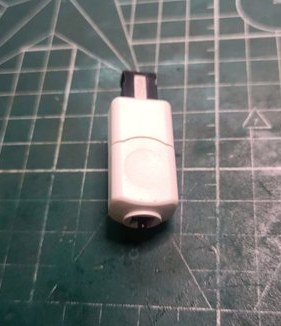
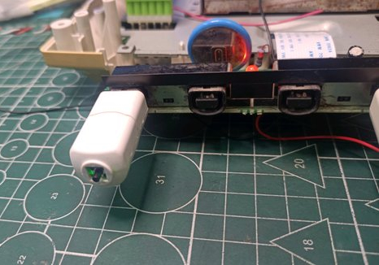
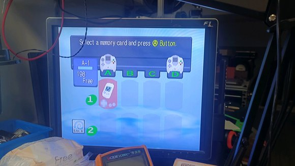
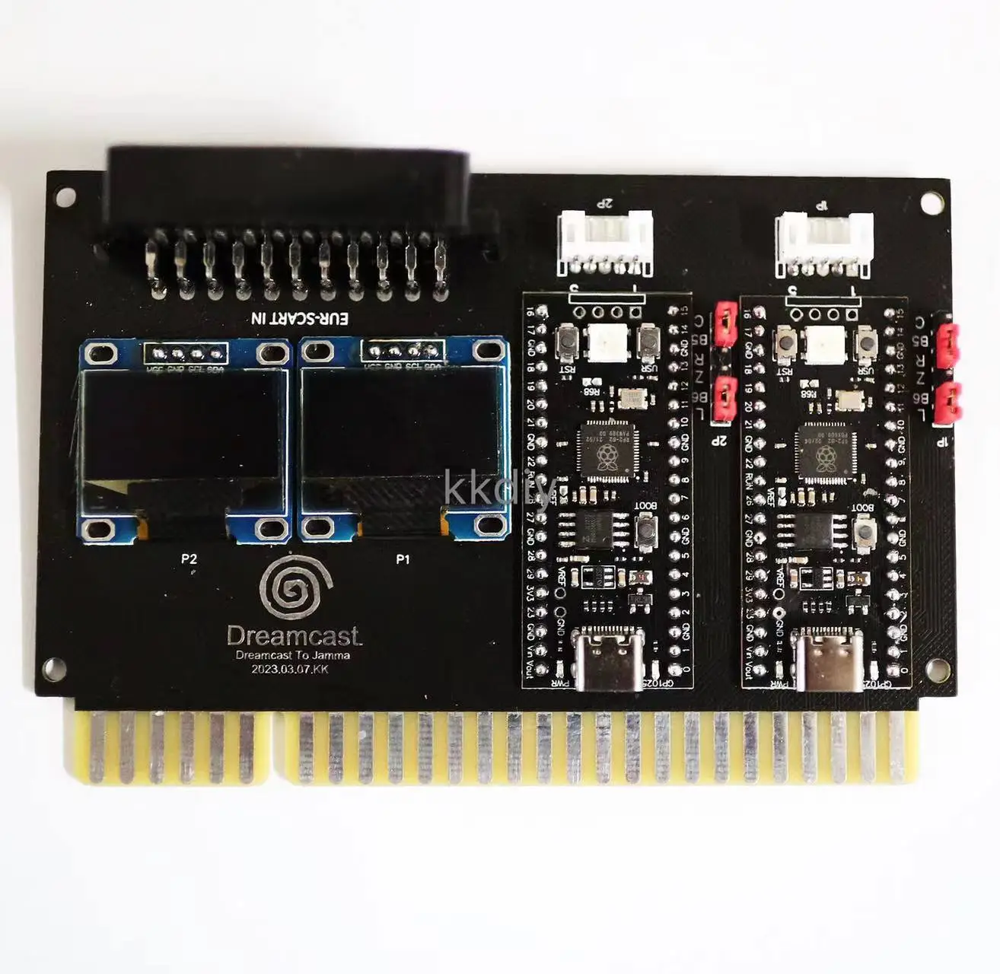
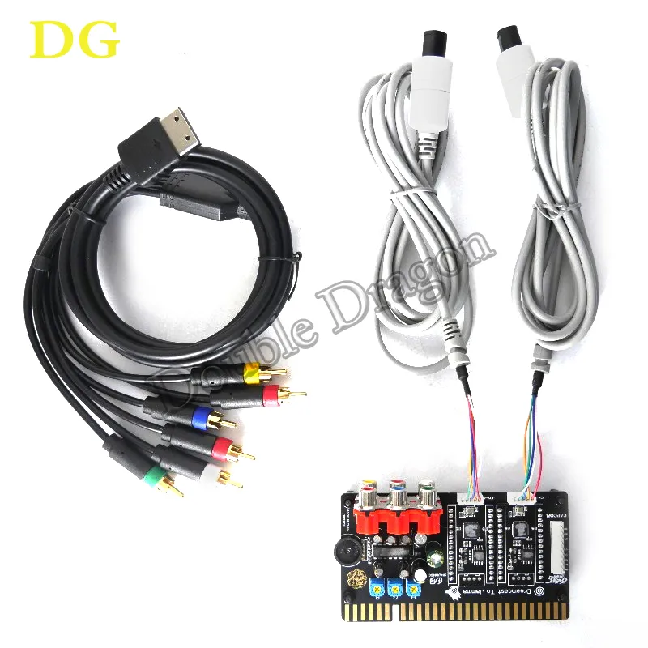
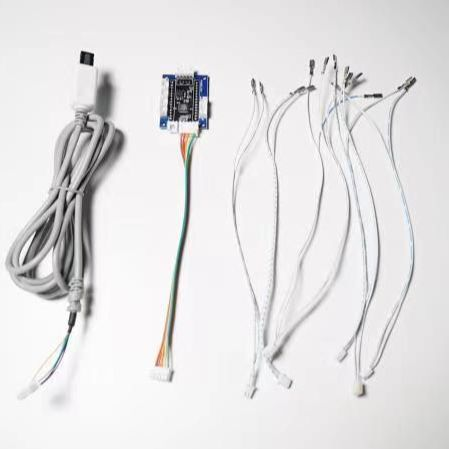

# MaplePad🍁 

MaplePad is an all-in-one Dreamcast controller, VMU, and Purupuru (rumble pack) emulator for Dreamcast portables and custom Dreamcast controllers. It runs on RP2040 and is usable with the Raspberry Pi Pico as well as custom MaplePad PCBs. See the [hardware folder](https://github.com/mackieks/MaplePad/tree/main/hardware) for a wiring diagram.

**Note:** MaplePad is still a WIP. You may experience issues with [Windows CE games](https://segaretro.org/Windows_CE). In almost all problematic titles, disabling VMU and rumble through the MaplePad menu will make the game playable. Check out the [Compatibility List](https://docs.google.com/spreadsheets/d/1JzTGN29Ci8SeuSGkQHLN1p6ayQNWUcsNw77SMujkjbs/edit?usp=sharing) for details!

## Features
With MaplePad you can cycle through 8 200-block internal VMUs with custom icons and colors, use an I2C or SPI OLED display to see the VMU screen in color and at 2x integer scale, and enjoy rumble that is 1:1 with the Performance TremorPak in most retail software (still some minor bugs!)

### Feature List:
- [x] Full FT0 (controller) support including analog joystick and triggers
- [x] Full FT1 (storage) support for savegames with 1600 blocks of space
- [x] Multipaging for memory card (8 separate 200-block memory cards)
- [x] Full FT2 (LCD) support with SSD1331 96\*64 color SPI OLED for VMU display (monochrome SSD1306 128\*64 I2C OLED also supported)
- [x] Customizable color palettes for all 8 internal memory cards
- [x] Robust FT8 (vibration) functionality (WIP)
- [x] Robust FT3 (timer/RTC) reporting for compatibility purposes (no RTC)
- [x] Basic menu on SSD1306 and SSD1331 OLED for configuring MaplePad behavior (WIP)

### To-do: 
Release v1.6 is gated by the following TODOs
- [ ] Finish menu (button test, VMU palette editor, misc. bugs)
- [ ] Address issues with non-CE games (Crazy Taxi, Blue Stinger, Powerstone 2)
- [ ] Finish FT8 (vibration) continuous vibration and AST

Future TODOs
- [ ] Fix compatibility with Windows CE games
- [ ] Implement 'fancy' VMU color palettes (gradients, animated backgrounds, etc.)
- [ ] Implement option for DC boot animation on OLED
- [ ] Add external RTC for true FT3 (timer/RTC) support
- [ ] Implement FT4 (microphone) support

## Project Showcase
*StrikerDC MaplePad mod by Wesk*

  

*MaplePad Arcade Controller with VMU by GamesCare. [link](https://gamescare.com.br/produto/controle-arcade-dreamcast-tela-de-vmu-e-8-vmus-virtuais-na-placa-maple-board/), [video](https://www.youtube.com/watch?v=b0IbSASR3B4/)*

 

*Mini plug'n'play virtual memory card by jounge. [link](https://tieba.baidu.com/p/8465994390)*

  

*Various JAMMA Dreamcast adapters available on AliExpress. [link 1](https://www.aliexpress.us/item/3256805216279752.html), [link 2](https://www.aliexpress.us/item/3256804674679708.html), [video](https://www.youtube.com/shorts/UciW3vM-KWo) (flashing lights warning!)*

   

*Giant Dreamcast VMU + Arcade Stick by CrazyJojo (code modified). [video](https://www.youtube.com/watch?v=bEA_On7P_g8)*

   

## Dumping VMUs to PC
You can use [picotool](https://github.com/raspberrypi/picotool) to dump VMUs manually. Here's the process:

- Put RP2040 into programming mode with BOOTSEL button and connect it to your PC
- Use picotool to dump whichever VMU page you want: `picotool save -r 10020000 10040000 dump1.bin`

- VMUs start at 0x10020000 and each one is 0x20000 long. So to save page 7, for example, you'd use 
`picotool save -r 100E0000 10100000 dump7.bin`
- Open dump in [VMU Explorer](https://segaretro.org/VMU_Explorer)

## License
 This work is licensed under a <a rel="license" href="http://creativecommons.org/licenses/by/4.0/">Creative Commons Attribution 4.0 International License</a>.

Share — copy and redistribute the material in any medium or format  
Adapt — remix, transform, and build upon the material for any purpose, even commercially.  
Attribution — You must give appropriate credit, provide a link to the license, and indicate if changes were made.  

MaplePad is forked from [Charlie Cole's Pop'n Music Controller.](https://github.com/charcole/Dreamcast-PopnMusic)

Special thanks: [Charlie Cole](https://github.com/charcole), [Colton Pawielski](https://github.com/cepawiel) and [Wesk](https://www.youtube.com/channel/UCYAwbbBxi5_LK8WVrD10SUw).
