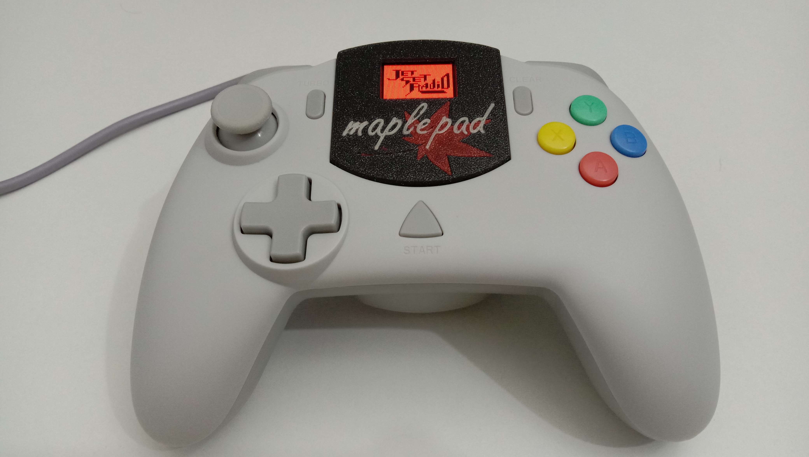
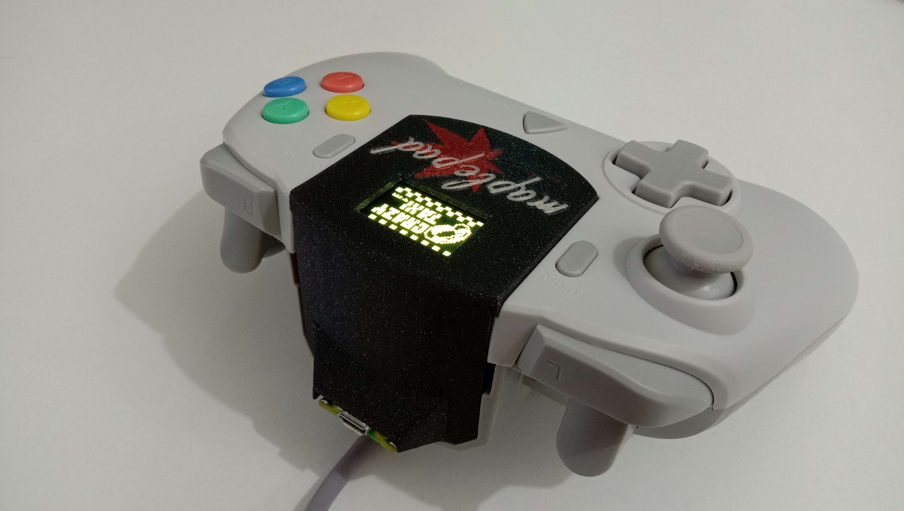
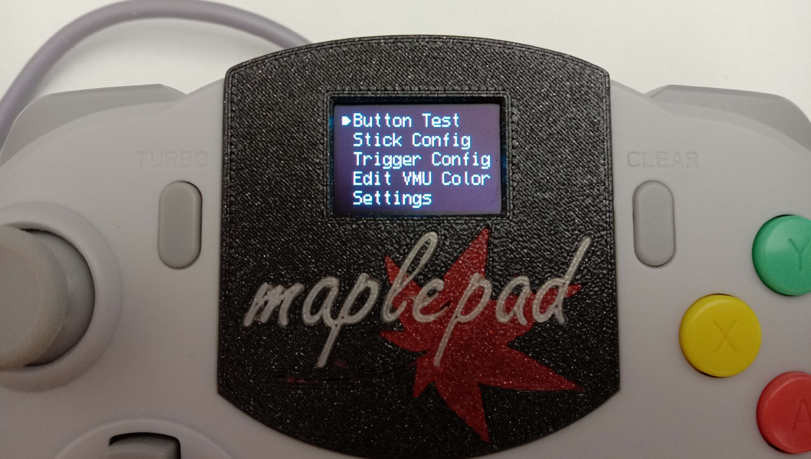
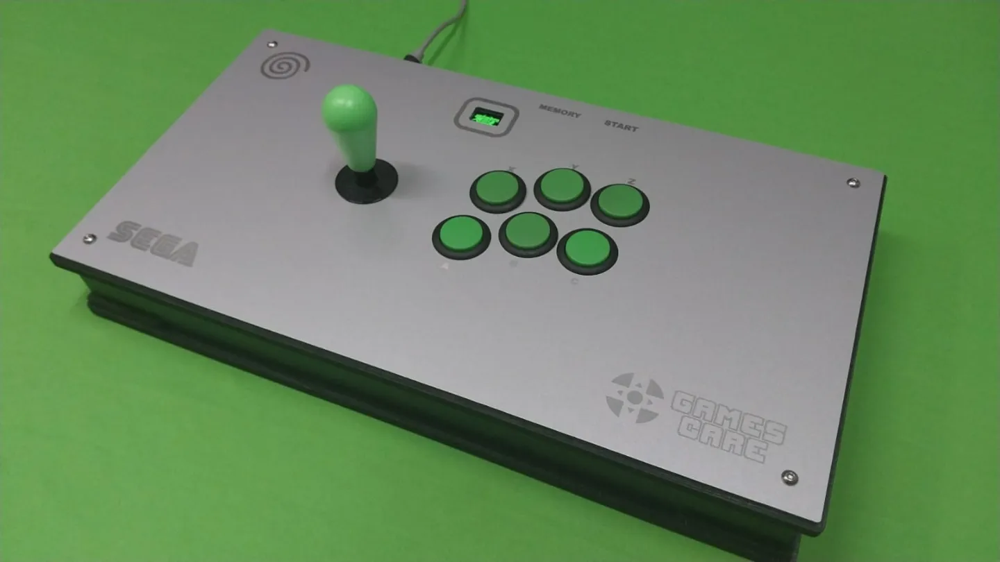
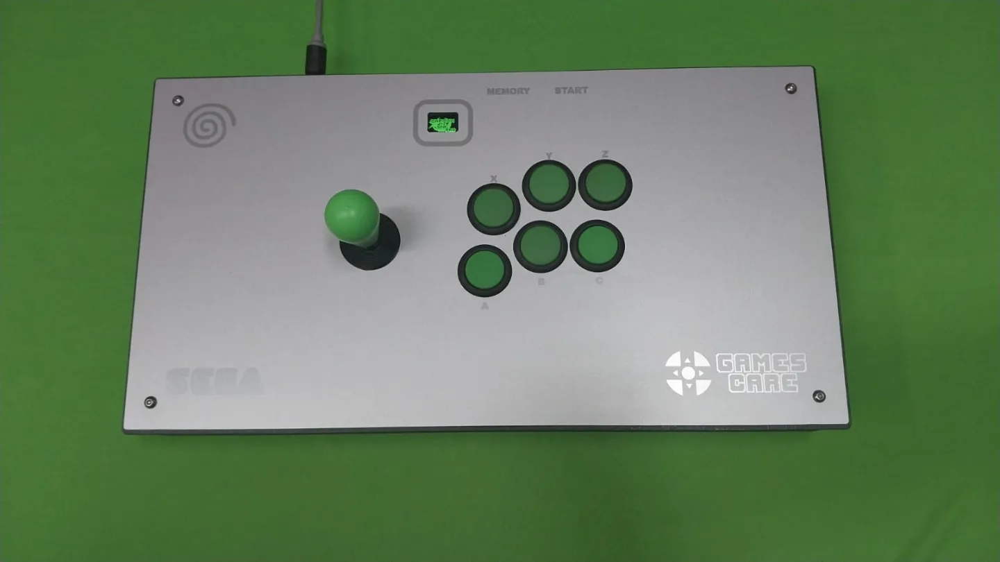
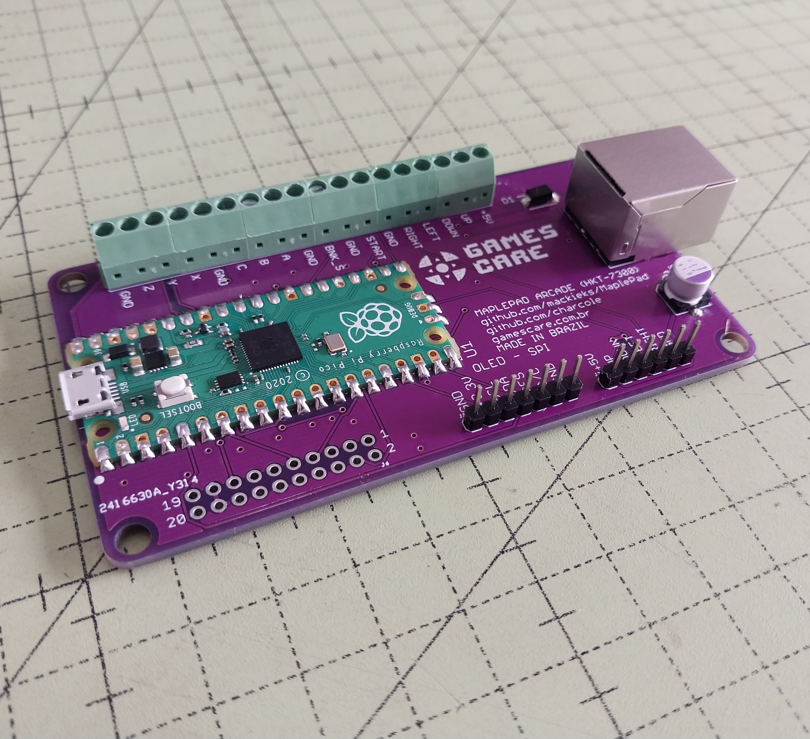
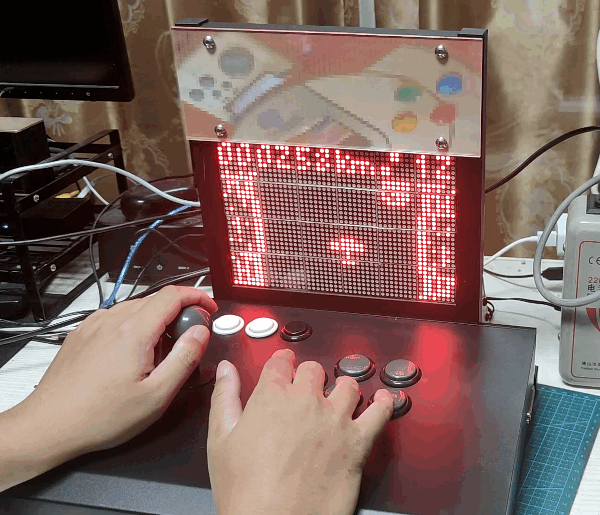
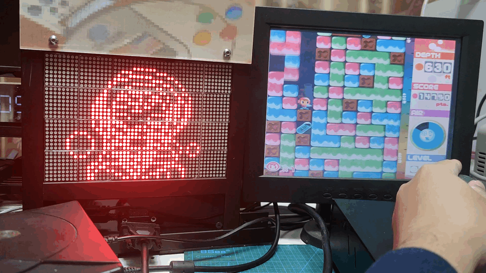

# MaplePad🍁 

MaplePad is an all-in-one Dreamcast controller, VMU, and Purupuru (rumble pack) emulator for use in Dreamcast portables and custom Dreamcast controllers. It can be used with either the Raspberry Pi Pico or a custom MaplePad PCB (see [hardware folder](https://github.com/mackieks/MaplePad/tree/main/hardware) for wiring diagram.)

**Note:** MaplePad is still a WIP. You may experience issues with [Windows CE games](https://segaretro.org/Windows_CE). In most problematic titles, disabling VMU and rumble through the MaplePad menu will make the game playable. Check out the [Compatibility List](https://docs.google.com/spreadsheets/d/1JzTGN29Ci8SeuSGkQHLN1p6ayQNWUcsNw77SMujkjbs/edit?usp=sharing) for details!

## Project Showcase
*StrikerDC MaplePad mod by Wesk*

  

*MaplePad Arcade Controller with VMU by GamesCare ([link](https://gamescare.com.br/produto/controle-arcade-dreamcast-tela-de-vmu-e-8-vmus-virtuais-na-placa-maple-board/))*

  

*Giant Dreamcast VMU + Arcade Stick by CrazyJojo (code modified, [video](https://www.youtube.com/watch?v=bEA_On7P_g8))*

   

## Features
With MaplePad you can: cycle through 8 200-block internal VMUs with custom icons and colors at your leisure...

...use an I2C or SPI OLED display to see the VMU screen in color and at 2x integer scale...

...and enjoy rumble that is 1:1 with the Performance TremorPak in most retail software (still some minor bugs!)

Feature List:
- [x] Full FT0 (controller) support including analog joystick and triggers
- [x] Full FT1 (storage) support for savegames with 1600 blocks of space
- [x] Multipaging for memory card (8 separate 200-block memory cards)
- [x] Full FT2 (LCD) support with SSD1331 96\*64 color SPI OLED for VMU display (monochrome SSD1306 128\*64 I2C OLED also supported)
- [x] Customizable color palettes for all 8 internal memory cards
- [x] Robust FT8 (vibration) functionality (WIP)
- [x] Robust FT3 (timer/RTC) reporting for compatibility purposes (no RTC)
- [x] Basic menu on SSD1306 and SSD1331 OLED for configuring MaplePad behavior (WIP)

To-do: (highest priority to lowest)
- [ ] Finish FT8 (vibration) continuous vibration and AST
- [ ] Finish menu for calibrating sticks and customizing MaplePad behavior
- [ ] Implement 'fancy' VMU color palettes (gradients, animated backgrounds, etc.)
- [ ] Implement DC boot animation on OLED
- [ ] Add external RTC for true FT3 (timer/RTC) support
- [ ] Implement FT4 (microphone) support

## License

   This work is licensed under a <a rel="license" href="http://creativecommons.org/licenses/by-sa/4.0/">Creative Commons Attribution-ShareAlike 4.0 International License</a>.

Share — copy and redistribute the material in any medium or format. Adapt — remix, transform, and build upon the material for any purpose, even commercially. Attribution — You must give appropriate credit, provide a link to the license, and indicate if changes were made. You may do so in any reasonable manner, but not in any way that suggests the licensor endorses you or your use. ShareAlike — If you remix, transform, or build upon the material, you must distribute your contributions under the same license as the original.

MaplePad is forked from [Charlie Cole's Pop'n Music Controller.](https://github.com/charcole/Dreamcast-PopnMusic)

Special thanks: [Charlie Cole](https://github.com/charcole), [Colton Pawielski](https://github.com/cepawiel) and [Wesk](https://www.youtube.com/channel/UCYAwbbBxi5_LK8WVrD10SUw).
