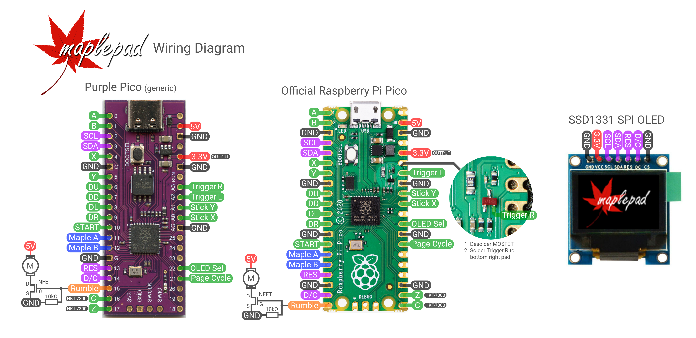
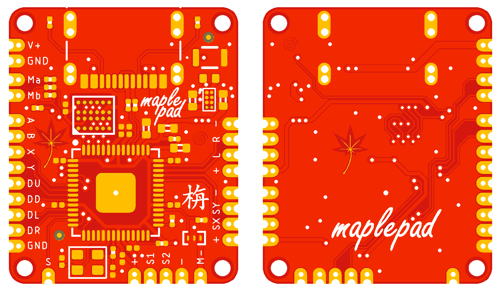

# Raspberry Pi Pico

Wiring diagram for Raspberry Pi Pico: 

Notes:
- The official Raspberry Pi Pico must be modded to access the right trigger pin (ADC3). See the wiring diagram for details.
- For rumble, use an N-channel FET with VGS(th) < 3V and Id ≥ 1A. Both large Xbox-style ERMs and coin-type vibration motors work well.
- You can add a freewheel diode between 5V and the NFET's drain if you'd like, but it's not necessary for prototyping.
- The SPI OLED runs at a high clock speed. Use at least 34AWG wire and keep the wires short and direct.

# MaplePad 

Replacement Dreamcast controller PCB for portablizing, using RP2040. EAGLE source, Gerbers, BOM and assembly drawing are available in this directory. (Photo below is of the previous revision which lacked the BOOTSEL button.)

Recommended board fabrication specs: 
- 0.8mm 2-layer PCB
- ENIG (for chipscale BGAs)
- Red soldermask - optional, but in keeping with the Japanese maple theme :) 

JLCPCB may grow the drills under the flash to meet their spec-- this is OK. Also please note that the extremely small castellations often result in many 'crushed barrels' that require manual cleanup.

Features:
- [x] 18.5 x 22.4mm 2-layer PCB
- [x] USB-C and BOOTSEL button for programming
- [x] Full Dreamcast controller compatibility
- [x] Analog joystick and triggers
- [x] VMU emulation (8-page VMU, 1600 blocks total)
- [x] SPI/I2C OLED for VMU screen
- [x] Rumble (Purupuru) support (WIP)
- [x] Power from 1.8V - 5.5V

What it doesn't support:
- [ ] Dual analog sticks
- [ ] Dreamcast Microphone
- [ ] Dreamcast Keyboard, Mouse, or Fishing Controller

A future version may support these features.
