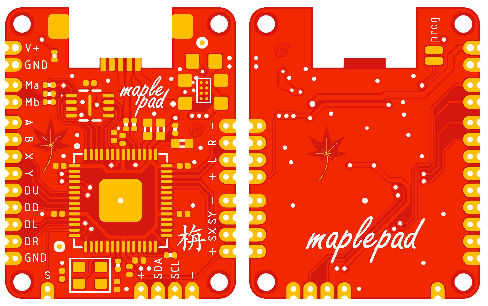

# MaplePad 

Replacement Dreamcast controller PCB using RP2040. Gerbers and BOM available in this directory.

Features:
- [x] 17 x 22mm
- [x] Analog joystick and triggers
- [x] VMU emulation
- [x] I2C OLED for VMU screen
- [x] Power from 1.8V - 5.5V
- [x] Future software-only features like multipaging 

What it doesn't support:
- [ ] Vibration
- [ ] Dual analog sticks

A future version will support these features.
